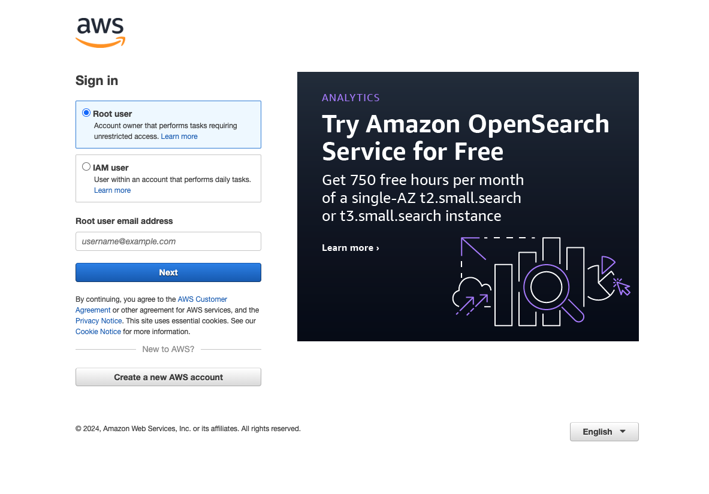
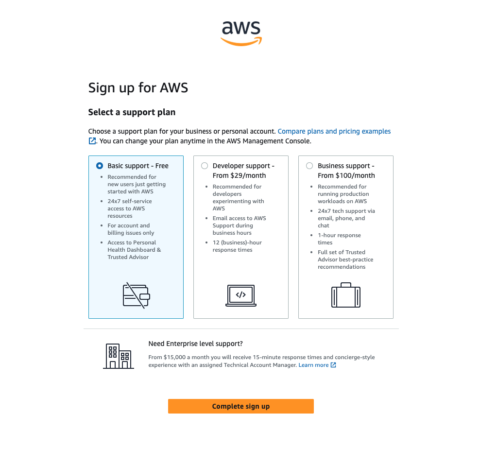
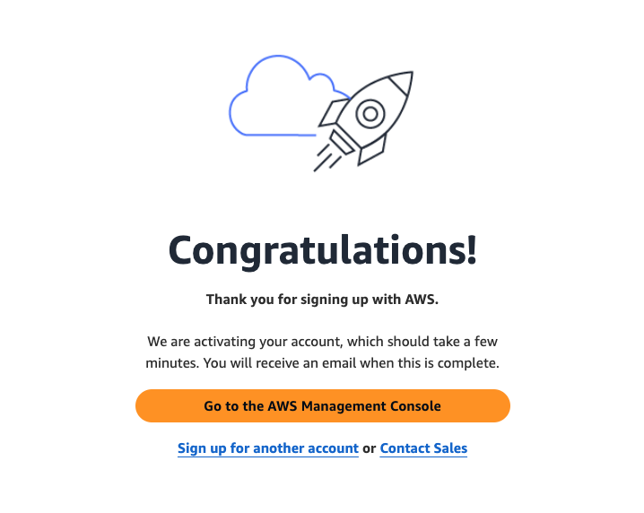
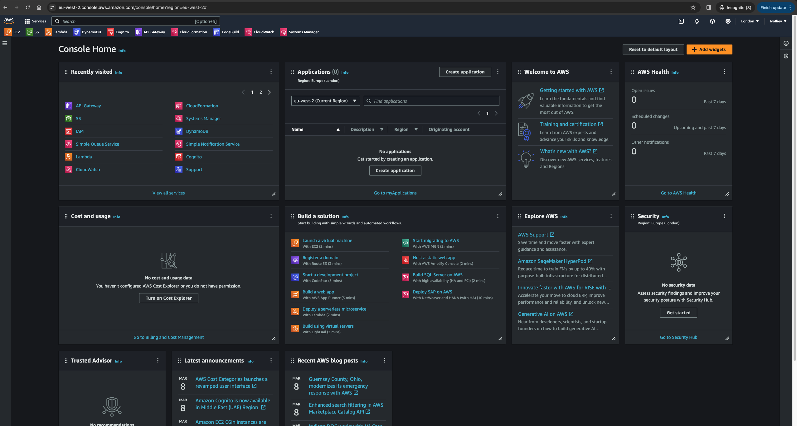
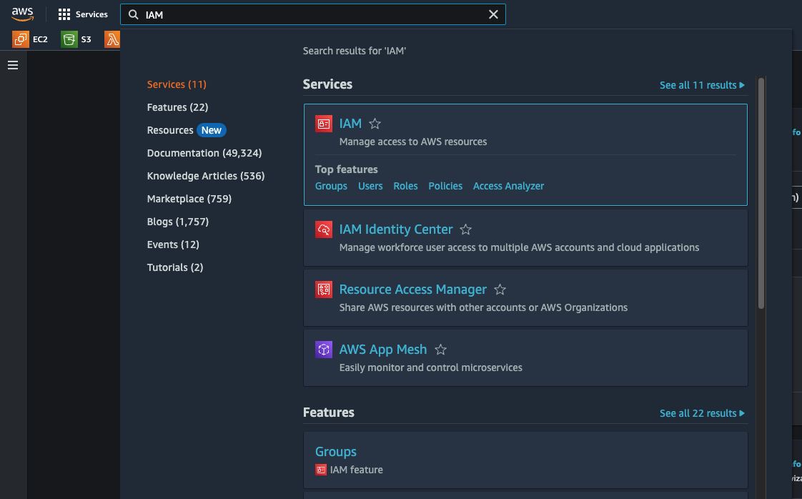
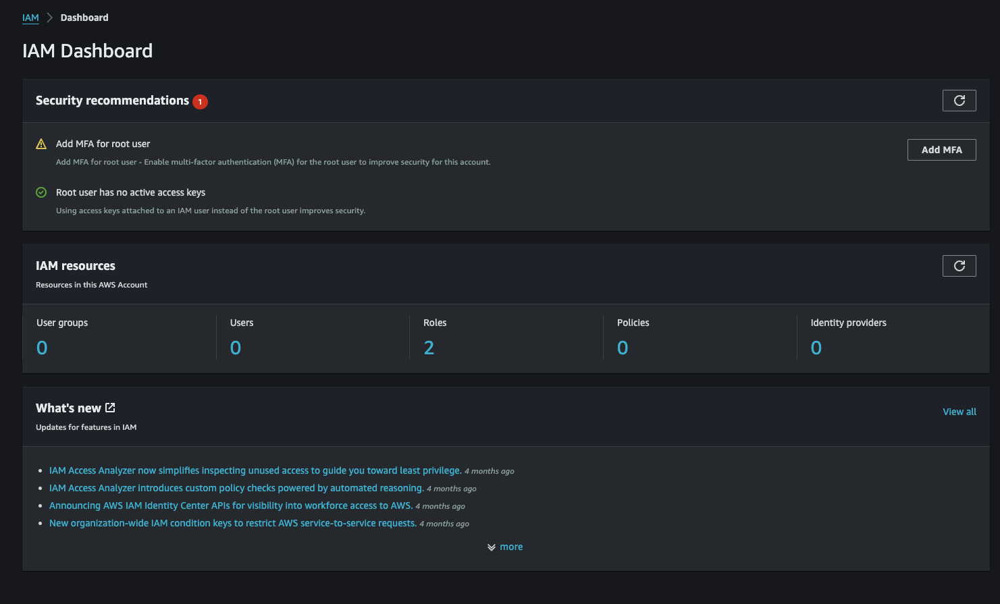
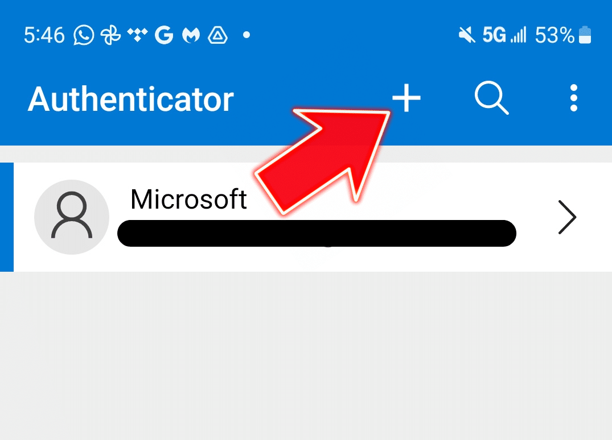
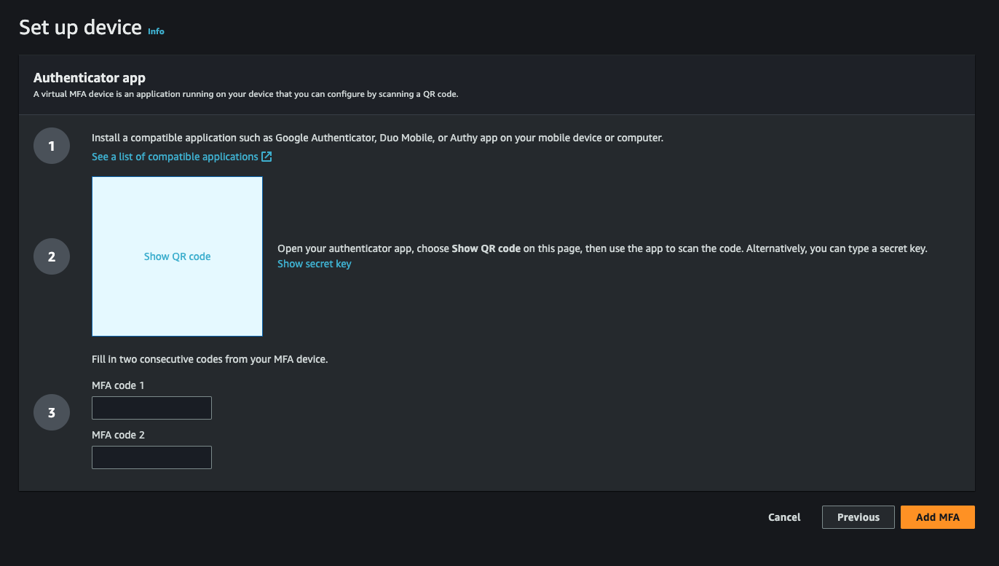

Contents:

- [Step by step guide on how to signup for **FREE** AWS Account (5 min)](#step-by-step-guide-on-how-to-signup-for-free-aws-account-5-min)
- [Sign in (1 min)](#sign-in-1-min)
- [Enable Multi-factor Authentication for your account (Optional, yet strongly advised - 5 min)](#enable-multi-factor-authentication-for-your-account-optional-yet-strongly-advised---5-min)

## Step by step guide on how to signup for **FREE** AWS Account (5 min)

1. Navigate to [https://aws.amazon.com/](https://aws.amazon.com/) and press `Sign in to the Console` from the top right corner
2. On the Sign in screen, click on `Create new AWS account`

   

3. Follow the steps on the screen.

   ❗️ On the question "How do you plan to use AWS" in step 2, select "Personal - for your own projects"

   ❗️ Enter billing information, during the workshop, we will utilize services available on the free tier, ensuring that you incur no charges.

   ❗️At the final step, select the basic support.

   

4. Congratulations! Your account will be activated in a few minutes.

   

---

## Sign in (1 min)

1. During your initial login, select `Root user` and input the email address you used to register.
2. Proceed to input your password on the next step. AWS might send you an email with a code to verify your account.
3. Upon a successful sign-in, the main dashboard will be displayed.

   

---

## Enable Multi-factor Authentication for your account (Optional, yet strongly advised - 5 min)

1. Search for IAM in the search bar
   
2. On the IAM Dashboard, under Security recommendations, find and click on Add MFA

3. If you don't have any Auth app, install [Microsoft Authenticator app](https://support.microsoft.com/en-gb/account-billing/download-and-install-the-microsoft-authenticator-app-351498fc-850a-45da-b7b6-27e523b8702a). In the `Device name` input, name your device e.g MyIPhone15. Press Next
4. Open the app on your phone and click on the `+` in the top right corner.

5. On the next step, select `Other account` and then `Scan with QR Code`
6. On your desktop, click on `Show QR Code` and scan it with your phone camera
   .
7. If you successful, you have added a new account in your Auth app. Find the new account and enter the MFA number from your app into the `MFA code 1` input. Wait a few seconds until it expires and enter the new code into `MFA code 2`.

8. Click on `Add MFA`. On success, you will be navigated to `My security credentials` dashboard and you will see your new device added under `Multi-factor authentication (MFA)`.
